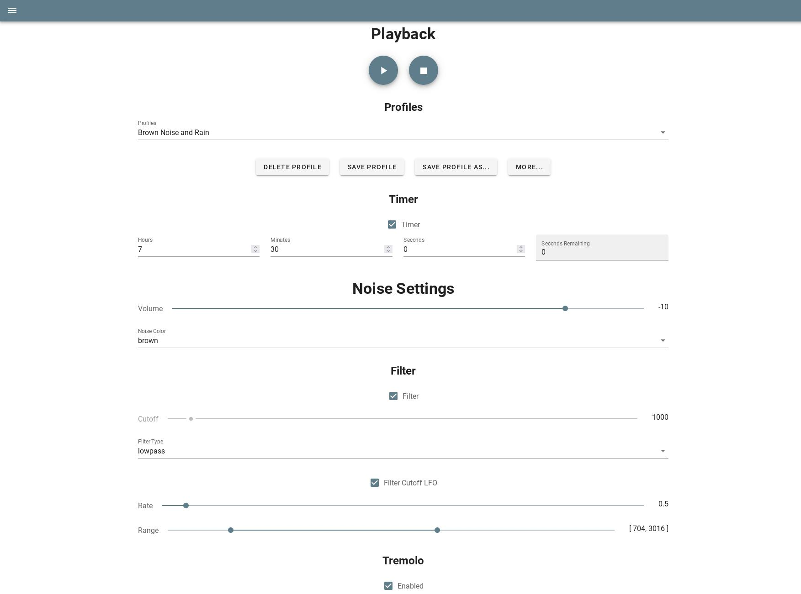

# Noisedash

Self-hostable web tool for generating ambient noises



(More screenshots on the [wiki](https://github.com/kaythomas0/noisedash/wiki/Screenshots))

# Features

* Generate and customize ambient noises and user-uploadable samples (leveraging [Tone.js](https://github.com/Tonejs/Tone.js/))
* Save "noise profiles" so you can easily switch between your created soundscapes, import and export them for easy sharing
* Fine-tune your noises with audio processing tools like filters, LFOs, and effects
* Upload and edit audio samples (e.g rain, wind, thunder) to combine with your generated noises
* Use admin tools to manage multiple users
* Mobile friendly

# Installation

## Docker

Requires docker and docker-compose

* Download the provided [docker-compose.yml file](https://github.com/kaythomas0/noisedash/blob/main/docker-compose.yml)
* In the same directory as the docker-compose file, created a folder called `config`, and inside it, put the provided [config file](https://github.com/kaythomas0/noisedash/blob/main/config/default.json)
* Edit the config file to your preference
* Bring the container up:

``` bash
docker-compose up -d
```

* Proceed to the URL where it's deployed and register your first user

(Raspberry Pi compatible images are available, see armv7 images on [Docker Hub](https://hub.docker.com/repository/docker/noisedash/noisedash))

## From Source

Requires node 14 and npm

* Clone the repo:

``` bash
git clone https://github.com/kaythomas0/noisedash.git
cd noisedash
```

* Edit `config/default.json` to your preference
* Install required packages and build the app:

``` bash
npm install
NODE_ENV=production npm run build
```

* The build files will be put into a directory called `dist`
* Run the server and serve static files:

``` bash
npm run server-prod
```

* Proceed to the URL where it's deployed and register your first user

# Contributing

See [CONTRIBUTING.md](https://github.com/kaythomas0/noisedash/blob/main/CONTRIBUTING.md)
